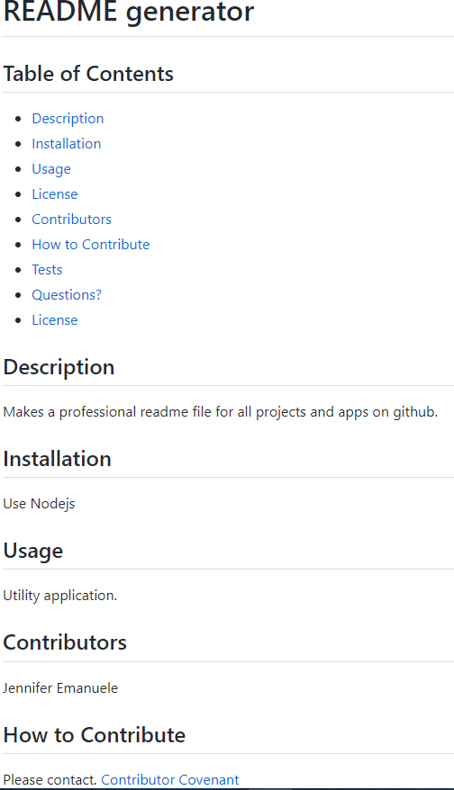

# readme generator
  ## Table of Contents
  * [Description](#description)
  * [Installation](#installation)
  * [Usage](#useage)
  * [License](#license)
  * [Contributors](#contributors)
  * [How to Contribute](#how-to-contribute)
  * [Tests](#tests)
  * [Questions?](#questions)
  * [License](#license)
  * [Screenshot]
  ## Description
  Generates a readme file for github
  ## Installation
  Nodejs
  ## Usage
  Utility app
  ## Contributors
  Jennifer Emanuele
  ## How to Contribute
  Contact.
  [
    Contributor Covenant](https://www.contributor-covenant.org/)
  ## Tests
  
  ## Questions?
  None.
  ## License
  Read more about MIT License here:
  [MIT License](https://opensource.org/licenses/MIT)
  ### Reach me here:
  [jenemanuele](https://github.com/jenemanuele) 
  or jemanuele@gmail.com
  ## Screenshot
 
  
  